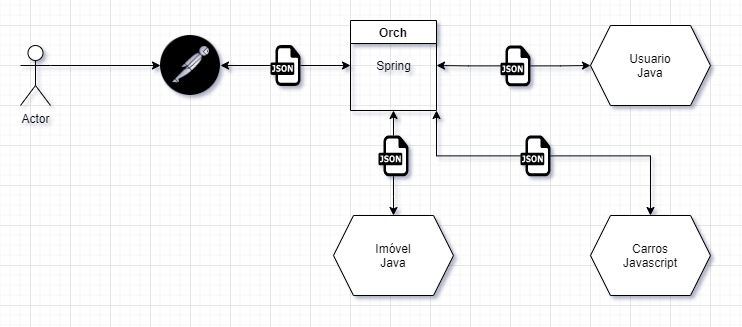
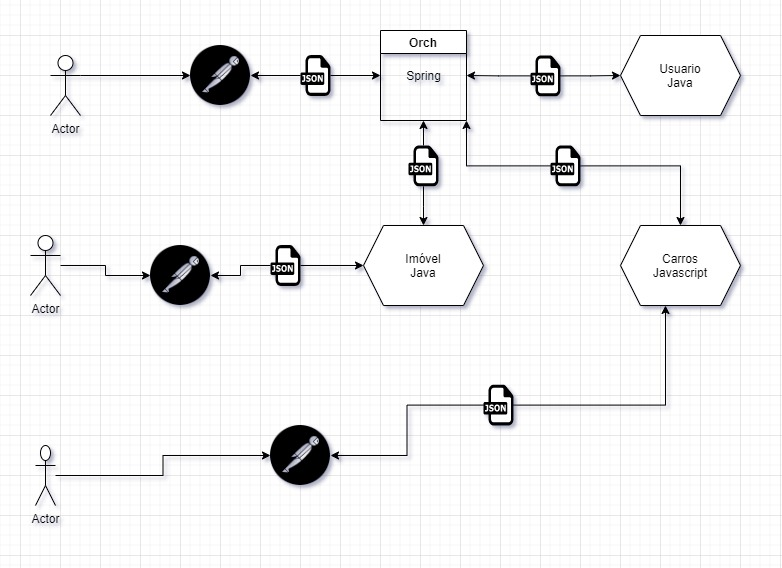

Arquitetura de microsserviços - Reforço Reset
====

Uma arquitetura de microsserviços não é uma bala de prata! É muito importante entender os ganhos, porém também é importante saber que quando você decidi ir por esse caminho vão existir complexidades a mais em seus projetos.

## Veja o desenho abaixo dos projetos que vamos utilizar:

Esse é um exemplo simples de alguns serviços. Repare que no caso desse desenho seria simples criar uma aplicação monolítica. Porém com o nosso exemplo aumentou consideravelmente a complexidade do projeto, pois ao invés de um backend agora temos 4, cada um com uma responsabilidade em específico. O que justificaria esse aumento de complexidade e até mesmo o aumento na quantidade de projetos?

* Escalabilidade
* Separação de responsabilidade
* Independência entre eles
* Subir deploys independentes

Obviamente existem várias vantagens em utilizar os microsserviços, porém iniciei mostrando que nem tudo são flores! Se você está na dúvida em criar um monolítico ou um microsserviço é melhor que você construa um monolítico e depois vá separando de acordo com o amadurecimento da aplicação.

## Veja o desenho abaixo:

## Notou algo diferente?

Repare que o ator que está acessando o imóvel não depende do serviços de Carros está no ar por exemplo e assim vice e versa. Uma das grandes vantagens é você ter uma maior disponibilidade dos seus serviços específicos.